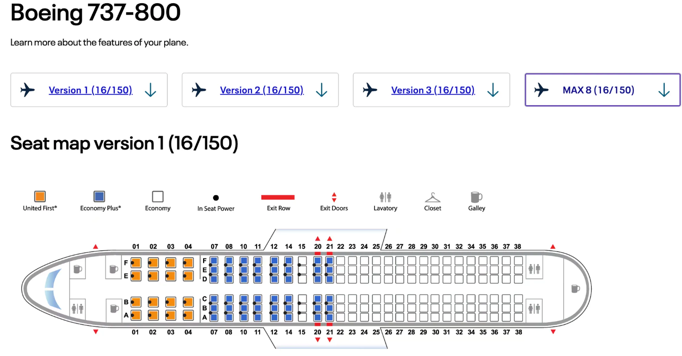
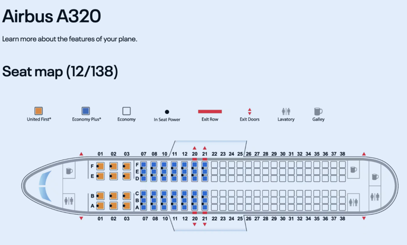
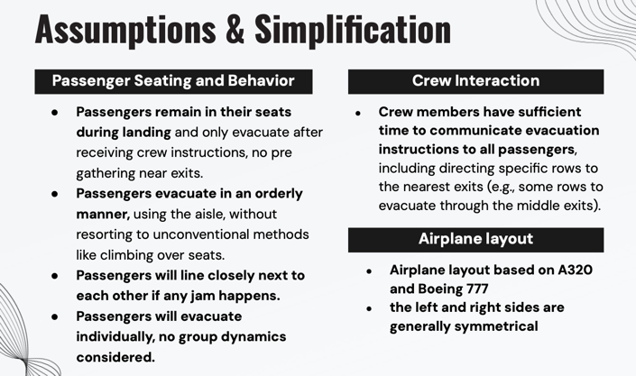
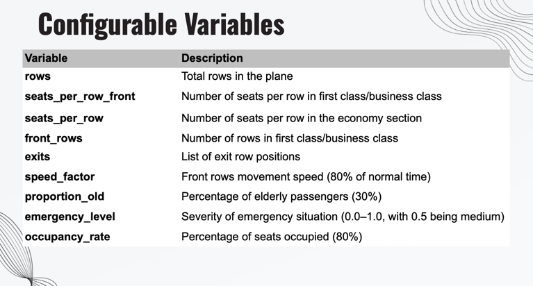
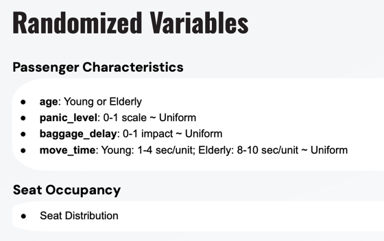
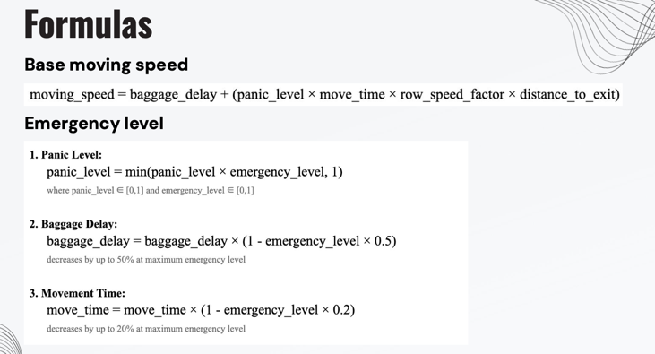
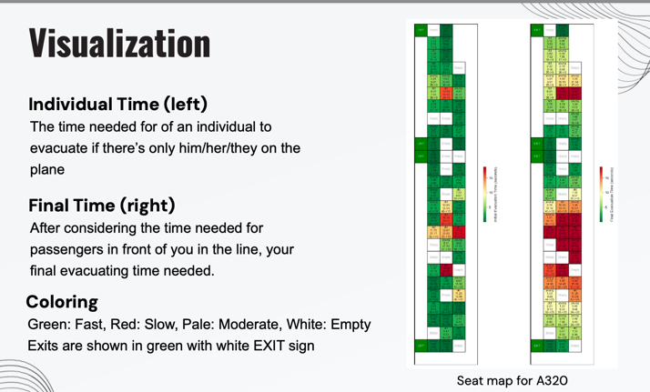
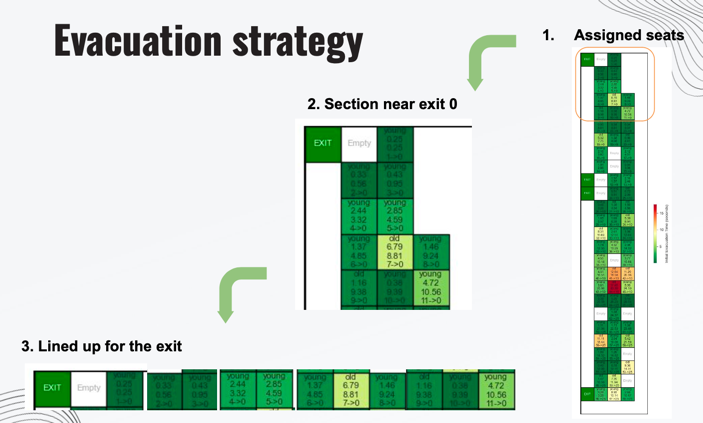

# 2024Fall_projects

## Project Background
Our team has designed a Monte Carlo simulation model for aircraft evacuation, inspired by the successful evacuation during the [Haneda Airport runway collision](https://en.wikipedia.org/wiki/2024_Haneda_Airport_runway_collision) on January 2, 2024. 

Despite the severity of the incident, where a runway collision led to further damage and casualties involving another aircraft, the Airbus A350-900 managed to evacuate all 367 passengers, including 8 infants, 30 foreigners and 12 crew members safely from three of its eight evacuation slides (doors 1L, 1R, and 4L). The whole evacuation took 20 minutes after the aircraft's landing.

### The Haneda Airport incident brought us several insights and questions that we decided to incorporate in the model design and test in experiments.
1. Exit Availability: Not all the exits will be available during the accident.
2. Crew Members' quick response and Passengers' cooperation: The crew's timely coordination and passenger compliance were essential in achieving a rapid and orderly evacuation, no one left with hand luggage.
3. Variety of Passengers might be slower in evacuation (due to the physical characteristics, panic level, other factors like foreigners’ communication issue)

This incident serves as a real-world case study demonstrating that under controlled yet high-pressure scenarios, effective evacuation strategies can significantly reduce casualties and save lives.

## Literature Review
To better understand the factors effecting evacuations, we referred to the previous studies and simulation designs.
Here are few factors we incorporated in our design.
1. Physical characteristics: Some factors that might influence passengers' moving speed, such as age
2. Psychological characteristics: Passengers might get panic during the evacuation
3. Baggage Delay: If passengers choose to get their baggage, this will influence the evacuation efficiency

## Simulate Read Scenario
To simulate the real scenario, we referred to the real aircraft seat map.

We picked Boeing 737, which is more commonly seen in the international airlines.

And A320

## Assumptions and Simplification

## Simulation Design - Variables

## Algorithm

Boeing 737 

## References
1. https://kth.diva-portal.org/smash/get/diva2:1885895/FULLTEXT01.pdf 
2. https://www.sciencedirect.com/science/article/pii/S0951832013002585?via%3Dihub
3. https://www.fire.tc.faa.gov/2010Conference/files/Cabin_Safety_I/GeaGroupedPassenger/GeaGroupedPassengerAbs.pdf 
4. https://www.sciencedirect.com/science/article/pii/S0379711221002526 
5. https://www.sciencedirect.com/science/article/pii/S0379711217301157
6. https://www.sciencedirect.com/science/article/pii/S0307904X15007842
7. https://www.sciencedirect.com/science/article/pii/S1877705816001065
8. https://www.researchgate.net/publication/349964459_Emergency_evacuation_simulation_of_commercial_aircraft
9. https://www.fire.tc.faa.gov/2007conference/files/Evacuation/TuesPM/GeaCompSim/GeaCompSimEgressAssistantDevicesNoVid.pdf