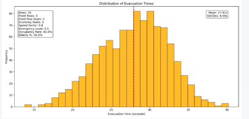
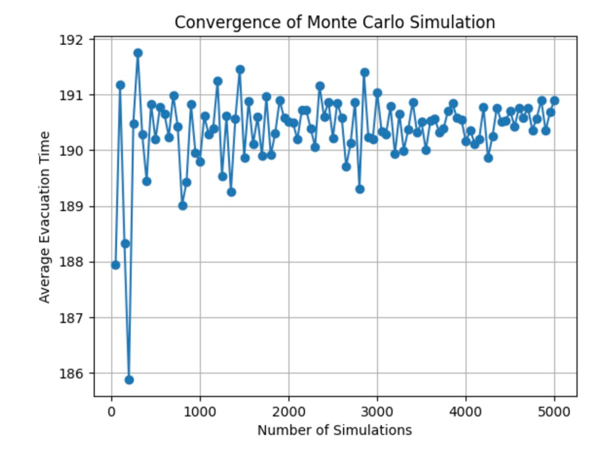
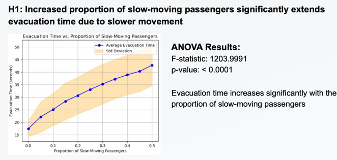
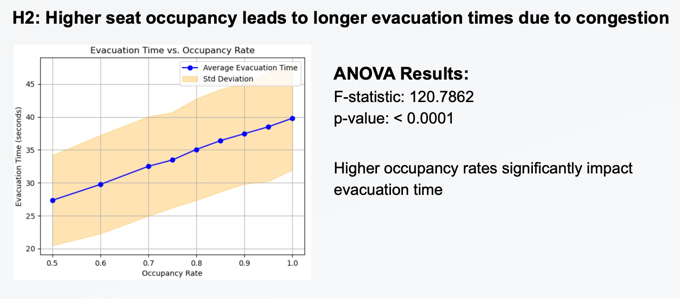
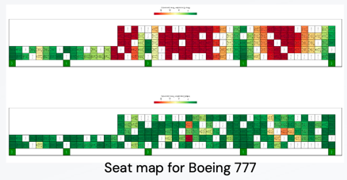
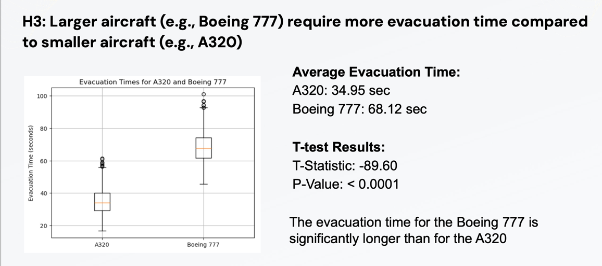
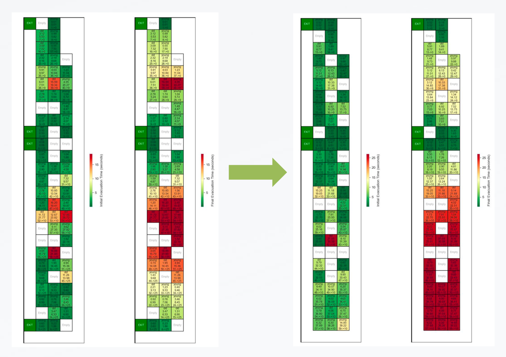
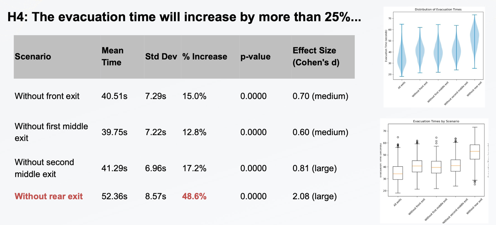

# 2024Fall_projects

## Project Background
Our team has designed a Monte Carlo simulation model for aircraft evacuation, inspired by the successful evacuation during the [Haneda Airport runway collision](https://en.wikipedia.org/wiki/2024_Haneda_Airport_runway_collision) on January 2, 2024. 

Despite the severity of the incident, where a runway collision led to further damage and casualties involving another aircraft, the Airbus A350-900 managed to evacuate all 367 passengers, including 8 infants, 30 foreigners and 12 crew members safely from three of its eight evacuation slides (doors 1L, 1R, and 4L). The whole evacuation took 20 minutes after the aircraft's landing.

### The Haneda Airport incident brought us several insights and questions that we decided to incorporate in the model design and test in experiments.
1. Exit Availability: Not all the exits will be available during the accident.
2. Crew Members' quick response and Passengers' cooperation: The crew's timely coordination and passenger compliance were essential in achieving a rapid and orderly evacuation, no one left with hand luggage.
3. Variety of Passengers might be slower in evacuation (due to the physical characteristics, panic level, other factors like foreigners’ communication issue)

This incident serves as a real-world case study demonstrating that under controlled yet high-pressure scenarios, effective evacuation strategies can significantly reduce casualties and save lives.

## Literature Review
To better understand the factors effecting evacuations, we referred to the previous studies and simulation designs.
Here are few factors we incorporated in our design.
1. Physical characteristics: Some factors that might influence passengers' moving speed, such as age
2. Psychological characteristics: Passengers might get panic during the evacuation
3. Baggage Delay: If passengers choose to get their baggage, this will influence the evacuation efficiency

## Simulate Read Scenario
To simulate the real scenario, we referred to the real aircraft seat map.

We picked Boeing 737, which is more commonly seen in the international airlines.

And A320

## Assumptions and Simplification

## Simulation Design - Variables

## Algorithm

## Model Validation
Simulation Outcome:

Convergence Verification:

## Hypotheses and Test
### H1: Increased proportion of slow-moving passengers significantly extends evacuation time due to slower movement

### H2: Higher seat occupancy leads to longer evacuation times due to congestion

### H3: Larger aircraft (e.g., Boeing 777) require more evacuation time compared to smaller aircraft (e.g., A320)

### H4: With 25% of exits disabled (1 out of 4), the evacuation time will increase by more than 25%, indicating a non-linear relationship between exit availability and evacuation efficiency.

## Conclusion
1. H1: Evacuation time increases significantly with the proportion of slow-moving passengers 
2. H2: Higher occupancy rates significantly impact evacuation time 
3. H3:The evacuation time for the Boeing 777 is significantly longer than for
the A320 
4. H4: The rear exit is most critical for the A320's evacuation efficiency, as its
failure leads to the largest increase in evacuation time (exceeding 25%) compared to other exit closures.

## Future Work
### Regarding Model Design
1. Panic Spreed: Model how high panic levels in one passenger influence others nearby
2. Crowd Dynamics: Include group evacuation dynamics
3. Injured Passengers: Simulate scenarios where injured passengers are unable to evacuate independently
4. Non-Compliant Behavior: Account for chaotic behaviors like climbing over seats, potentially causing delays
### Regarding Simulation Real Scenario
1. Refer to real time spent on each movement (e.g. door opening time), try to simulate real evacuation time more accurately. (Compare to [FAA 90 seconds rule](https://www.faa.gov/documentLibrary/media/Advisory_Circular/AC_25.803-1A.pdf))
2. Include Crew Members' evacuation time

## References
1. https://kth.diva-portal.org/smash/get/diva2:1885895/FULLTEXT01.pdf 
2. https://www.sciencedirect.com/science/article/pii/S0951832013002585?via%3Dihub
3. https://www.fire.tc.faa.gov/2010Conference/files/Cabin_Safety_I/GeaGroupedPassenger/GeaGroupedPassengerAbs.pdf 
4. https://www.sciencedirect.com/science/article/pii/S0379711221002526 
5. https://www.sciencedirect.com/science/article/pii/S0379711217301157
6. https://www.sciencedirect.com/science/article/pii/S0307904X15007842
7. https://www.sciencedirect.com/science/article/pii/S1877705816001065
8. https://www.researchgate.net/publication/349964459_Emergency_evacuation_simulation_of_commercial_aircraft
9. https://www.fire.tc.faa.gov/2007conference/files/Evacuation/TuesPM/GeaCompSim/GeaCompSimEgressAssistantDevicesNoVid.pdf